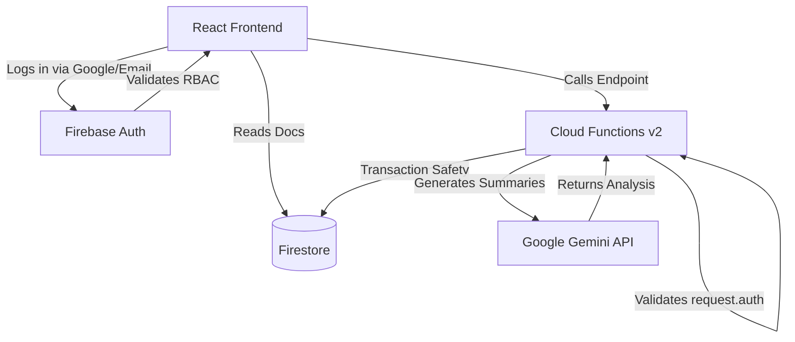

# CareManager

A comprehensive Healthcare Appointment & Follow-up Manager built for patients, doctors, and administrators to streamline booking, electronic health records (EHR), and automated AI-driven summaries.

## ■ Live Demo
[Deployed App](https://unthinkable-7d043.web.app)

## ■ Problem
Booking doctor appointments is often disconnected from the patient's actual medical context, leading to rushed visits. Patients lack clear visibility into their past and upcoming appointments, while doctors lack automated context regarding the patient's immediate symptoms and overall health profile before the visit.

## ■■ Tech Stack
TypeScript / React (Vite) / Firebase Firestore / Firebase Functions / Google Gemini AI

## ■ Features
- **Smart Booking & Scheduling** (Patients can view available doctors and slot times to book appointments with real-time conflict resolution)
- **AI Pre-visit Summaries** (Doctors receive AI-generated summaries detailing patient urgency and suggested questions before the visit)
- **AI Post-visit Summaries** (Doctors can enter clinical notes which are automatically converted into patient-friendly follow-up instructions)
- **Integrated Medical Profile** (Patients can maintain their EHR, including vitals and allergies, which instantly syncs with the doctor's dashboard)

## ■ Setup & Run Locally
```bash
git clone <repo>
cd healthcare-manager
npm install
npm run dev
```

## ■ Testing
For local testing, the application uses Vite's built-in dev server.

## ■■ Architecture / Approach
The application separates concerns between a React frontend and Firebase serverless backend. 
- **Frontend:** Built with React, Vite, and Tailwind CSS. The app features role-based access control (RBAC), routing users to Patient, Doctor, or Admin dashboards based on their authentication claims.
- **Backend:** Firebase Cloud Functions v2 handle the core business logic. Specifically, the `bookAppointment` function ensures transaction safety to prevent double-booking. The Gemini AI integration is moved to the backend to securely manage API keys and perform LLM inference for pre/post-visit summaries.
- **Tradeoffs:** To avoid complex composite index requirements on Firestore which can cause deployment delays, multi-field filtering is handled efficiently by combining single-field indexing with localized client/server filtering.



## ■ What I'd improve with more time
With more time, I would implement an automated email/SMS reminder system using a PubSub scheduled Cloud Function and SendGrid. I would also add more comprehensive unit tests for the React components using Jest and React Testing Library.
