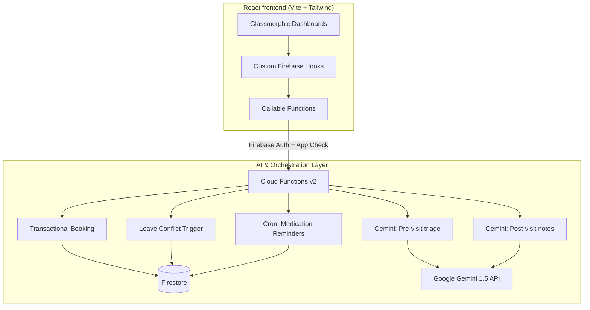

<p align="center">
  
</p>

# CareManager

**A production-ready healthcare management platform built around Gemini AI pre-visit summaries, transactional smart-booking, and automated follow-ups — all orchestrated on Firebase Functions v2.**

CareManager is an AI-native clinic management platform. The domain is healthcare scheduling; the engineering problem is automating the manual triage and follow-up processes at consumer-app latency, ensuring zero double-booking through robust transactions, and presenting it all in a premium, glassmorphic UI. This README focuses on how that's built.


**Live Demo:** [https://unthinkable-7d043.web.app](https://unthinkable-7d043.web.app)

## Engineering highlights

- **AI-Native Pre-Visit Summaries** — Patients input raw symptoms naturally. Google Gemini AI processes the data to generate structured urgency levels, chief complaints, and suggested questions for the doctor before the patient even steps into the clinic.
- **Transactional Smart-Booking** — Advanced scheduling prevents double-booking using strictly enforced Firestore transactions, ensuring data integrity at the database layer even under concurrent booking attempts.
- **Autonomous Conflict Resolution (Event-Driven)** — If a doctor submits a leave request, an `onDocumentCreated` Firestore trigger automatically crawls the schedule, cancels all conflicting appointments, and queues patient notification events.
- **Automated Post-Visit Summaries** — Doctors provide shorthand notes, and the LLM translates them into patient-friendly follow-up instructions and structured medication schedules.
- **Background Cron Processing** — Smart medication reminders run on automated background schedulers (Firebase Scheduled Functions) to process active prescriptions and simulate reminder emails to ensure medical adherence.
- **Cost & Latency Engineering** — Cloud Functions utilize lazy-initialization to eliminate cold-start timeouts and guarantee a 0ms top-level execution footprint, ensuring rapid deployment and response times.

## System architecture



## The AI pipeline in detail

### 1. Model layer

| Concern | Approach |
|---|---|
| Pre-visit triage | `gemini-1.5-flash` analyzes raw patient symptom strings into structured priority vectors and doctor Q&A. |
| Post-visit translation | `gemini-1.5-flash` translates medical shorthand into patient-friendly instructions and medication tables. |
| Security | All API calls are executed strictly server-side in Cloud Functions. No API keys are shipped to the client bundle. |

The AI integrations are heavily prompt-engineered to ensure deterministic formatting, returning clear urgency levels (Low/Medium/High) and exact follow-up steps.

### 2. Event-Driven Database Triggers

The system leverages Firebase's event-driven architecture to keep state consistent. When a leave is registered in the `leaves` collection, the background trigger instantly queries the `appointments` collection, batches cancellations for the exact date, and commits the batch atomically.

## Security & Deployment

- **Zero-Leak Policy:** Strict `.gitignore` enforcement ensures `.env` files are never tracked. Keys are injected at runtime via environment variables in Google Cloud.
- **Modern Runtime:** The backend operates on Node.js 22 (LTS) for maximum performance and security compliance.
- **Hosting:** The frontend is bundled via Vite and globally CDN-distributed through Firebase Hosting.

## Google Calendar Setup Steps

To enable automated calendar invites for booked appointments and cancellations, you must configure a Google Cloud Service Account or OAuth Client:
1. Navigate to the [Google Cloud Console](https://console.cloud.google.com/).
2. Create a new project and enable the **Google Calendar API**.
3. Under **Credentials**, create an **OAuth 2.0 Client ID** (Web application).
4. Note your `Client ID` and `Client Secret`. 
5. Authorize the client locally using the Google OAuth Playground to retrieve a persistent `Refresh Token`.
6. Add these credentials to your Firebase Secret Manager by running:
   ```bash
   firebase functions:secrets:set GOOGLE_CALENDAR_CLIENT_ID
   firebase functions:secrets:set GOOGLE_CALENDAR_CLIENT_SECRET
   firebase functions:secrets:set GOOGLE_CALENDAR_REFRESH_TOKEN
   ```

## License

This project is licensed under the MIT License - see the [LICENSE](LICENSE) file for details.
